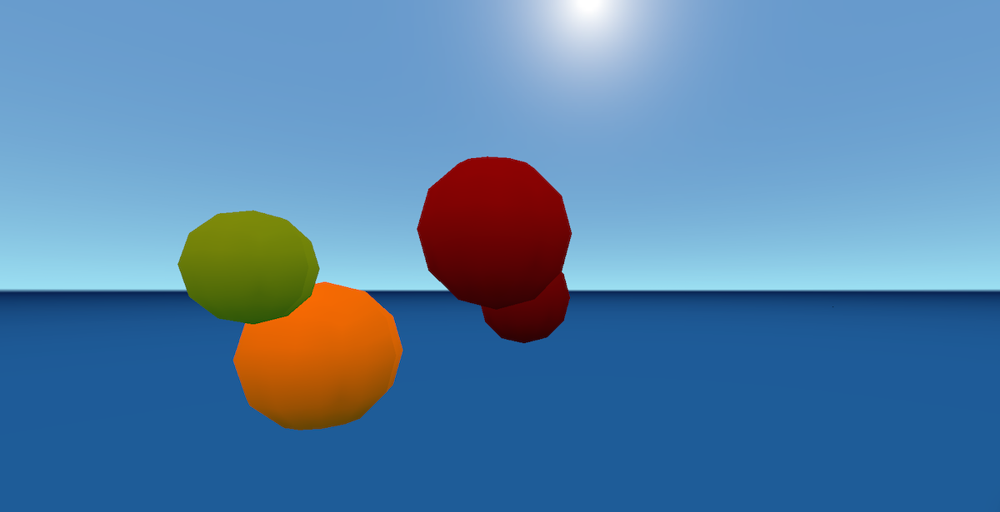

# Blooming

Inspired by Brian Eno and Peter Chilvers [Bloom](https://apps.apple.com/us/app/bloom/id292792586) app, this is an experimental, basic 3D version using [Godot](https://godotengine.org/) engine.

**[Click here to try the demo](https://dmgarland.github.io/blooming/)**

## How to use

Using your mouse, there are three sounds assigned to each mouse button. Click the screen and a note will play at a random pitch, and then loop. Moving the mouse moves the camera and you should notice 3D panning effects as you look around.

Using your keyboard arrow keys, you and look left / right and move forwards and back to have a wander about. You ought to notice 3D spatialisation effecsts and panning as you look. The mouse also allows you to look up / down.
sudo service udev restart
